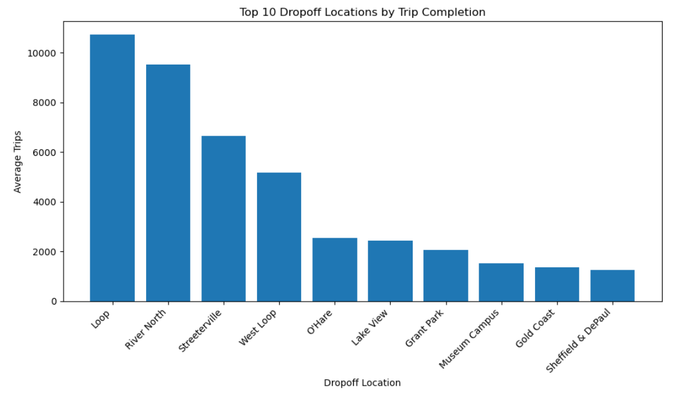
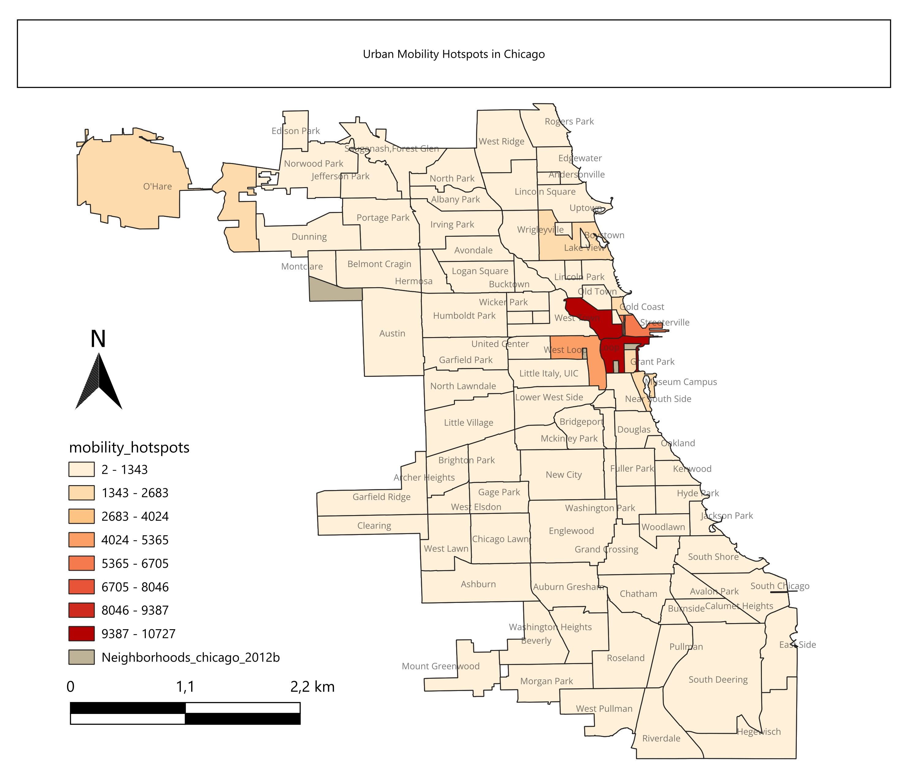
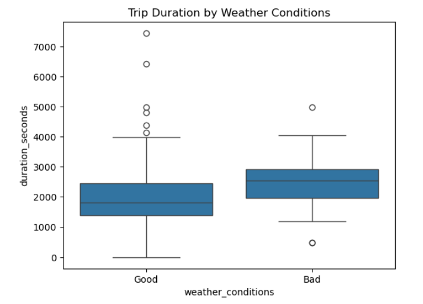

# Geospatial-Analysis-of-Urban-Mobility-Patterns-and-Weather-Impacts

## Project Overview

This project analyzes urban mobility patterns in Chicago using taxi trip data, weather conditions, and geospatial visualization techniques.

The analysis combines SQL, Python, GeoPandas, and QGIS to explore spatial concentration of trips, mobility hotspots, and the influence of weather conditions on transportation dynamics.

---

## Objectives

- Identify high-demand destination neighborhoods across Chicago.
- Analyze spatial distribution of taxi trip activity.
- Explore the relationship between weather conditions and travel duration.
- Visualize urban mobility hotspots through GIS mapping techniques.
- Demonstrate geospatial and sustainability-oriented data analysis workflows.

---

## Technologies Used

Python    ---    SQL    ---    pandas    ---    GeoPandas    ---    QGIS    ---    matplotlib    ---    SciPy

---

## Workflow
### 1. Data Acquisition
- Imported SQL query outputs containing taxi company activity, destination neighborhoods, and trip duration records.
- Retrieved weather data from an external HTML source using web scraping techniques.

### 2. Data Preparation
- Inspected datasets for data quality issues, missing values, and duplicates.
- Validated data types and converted timestamps to datetime format.
- Created temporal features for time-based analysis.

### 3. Exploratory Data Analysis
- Evaluated taxi company activity across Chicago.
- Identified the top neighborhoods by average taxi trip drop-offs.
- Explored trip duration distributions and weather condition frequencies.

### 4. Temporal Mobility Analysis
- Analyzed average trip duration by hour of day.
- Identified periods associated with longer travel times.

### 5. Geospatial Analysis
- Integrated neighborhood level mobility data with Chicago neighborhood boundaries.
- Created a choropleth map to visualize the spatial distribution of taxi trip destinations.
- Identified urban mobility hotspots and spatial clustering patterns.

### 6. Weather Impact Analysis
- Compared trip duration distributions under different weather conditions.
- Visualized weather-related differences using descriptive statistics and boxplots.

### 7. Statistical Testing
- Applied Levene's test to evaluate variance homogeneity.
- Performed an independent samples t-test to assess whether weather conditions significantly affect travel duration.
  
---
## Results

### Top Destination Neighborhoods

### Geospatial Mobility Hotspots

### Weather Impact on Travel Duration

## Key Insights
- The Loop emerged as Chicago's primary mobility hub, recording the highest average number of taxi trip drop-offs.
- Urban mobility demand is spatially concentrated within the city's central districts, particularly around Loop, River North, Streeterville, and West Loop.
- The choropleth map revealed clear spatial clustering patterns, indicating that transportation demand is strongly associated with economic activity, connectivity, and service density.
- Average trip duration varies throughout the day, with longer travel times generally observed during afternoon hours.
- Most taxi trips occurred under favorable weather conditions; however, adverse weather was associated with longer travel times.
- Boxplot analysis showed a noticeable upward shift in trip duration under poor weather conditions, suggesting a potential weather-related effect.
- Statistical testing confirmed that weather conditions significantly influence travel duration between the Loop and O'Hare International Airport (p ≈ 6.5 × 10⁻¹²).
- Combining Python, GIS, statistical analysis, and urban mobility data provided a multidimensional view of transportation dynamics in Chicago.

